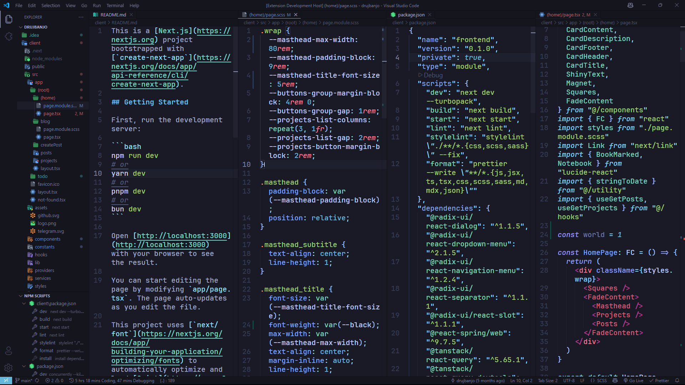
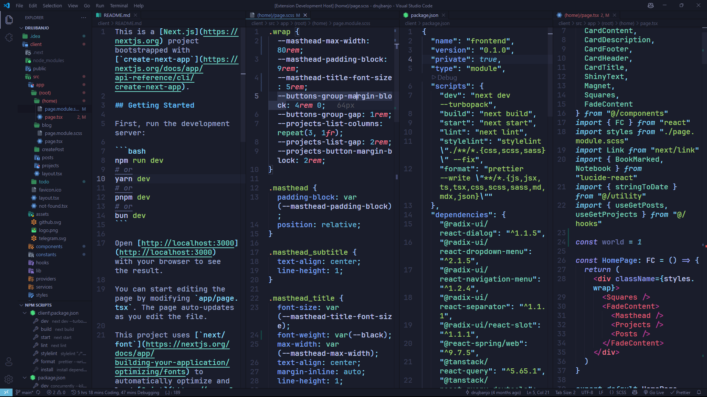
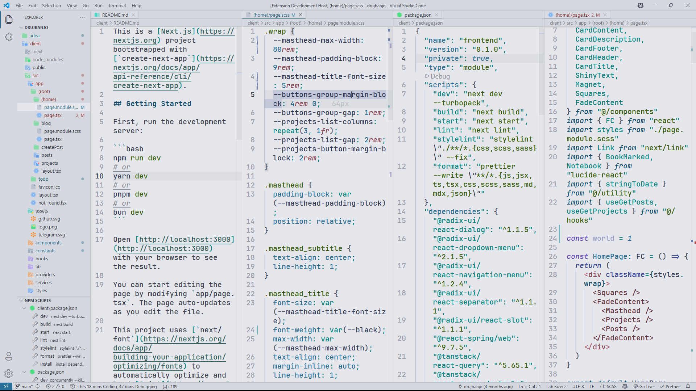

# [Ban theme](https://marketplace.visualstudio.com/items?itemName=drujban.ban-theme&ssr=false#overview)
A beautiful Visual Studio Code Theme based on [Tokyo Night](https://marketplace.visualstudio.com/items?itemName=drujban.ban-theme&ssr=false#overview)

### Screenshots

**Ban Night**

**Ban Typhoon**

**Ban Light**

Font used in the screenshots is [JetBrains Mono.](https://www.jetbrains.com/lp/mono/)
  

### 🎨 Ban Night — Color Palette

| Color                                                               | Usage                                                                   |
| ------------------------------------------------------------------- | ----------------------------------------------------------------------- |
|  `#F7768E` | JSX/HTML tags, spread operator, terminal red                            |
|  `#FF9E64` | Function arguments, CSS pseudo-elements, warnings                       |
|  `#64B7DA` | Numbers, booleans, UI buttons, terminal cyan                            |
|  `#9ECE6A` | Strings, CSS classes, JSON level 8                                      |
|  `#73DACA` | Object keys, markdown links, variables in preprocessors, terminal green |
|  `#7AA2F7` | Function names, CSS property names, terminal blue                       |
|  `#919FF1` | Keywords, operators, HTML attributes, deprecated                        |
|  `#C0CAF5` | Variables, class names, `this`, JS constants                            |
|  `#A9B1D6` | Default text, panel headers, list selections                            |
|  `#7DCFFF` | Object properties, import/export, terminal cyan                         |
|  `#B4F9F8` | Regex strings                                                           |
|  `#41A6B5` | Vue props, inserted text in diffs                                       |
|  `#DE5971` | Custom JSX/HTML tags                                                    |
|  `#BA3C97` | Tag punctuation (e.g. `<` `>`)                                          |
|  `#51597D` | Comments                                                                |
|  `#646E9C` | Doc-comments, GitLens, inline hints                                     |
|  `#6183BB` | Git modified, settings section titles                                   |
|  `#FF5370` | Errors                                                                  |
|  `#DB4B4B` | Editor errors, conflict blocks, removals                                |
|  `#914C54` | Git deleted files, diff removals                                        |
|  `#191A25` | Editor background                                                       |
|  `#15151D` | Tabs, sidebar, panel backgrounds                                        |
|  `#101014` | Borders and separators                                                  |
|  `#363B54` | Line numbers, inactive UI, terminal black                               |
|  `#ACB0D0` | Badge text, light labels                                                |

### 🎨 Ban Typhoon — Color Palette

| Color                                                               | Usage                                                                   |
| ------------------------------------------------------------------- | ----------------------------------------------------------------------- |
|  `#F7768E` | JSX/HTML tags, spread operator, terminal red                            |
|  `#FCA16A` | Function arguments, CSS pseudo-elements, warnings                       |
|  `#64B7DA` | Numbers, booleans, UI buttons, terminal cyan                            |
|  `#9ECE6A` | Strings, CSS classes, JSON level 8                                      |
|  `#73DACA` | Object keys, markdown links, variables in preprocessors, terminal green |
|  `#7AA2F7` | Function names, CSS property names, terminal blue                       |
|  `#919FF1` | Keywords, operators, HTML attributes, deprecated                        |
|  `#C0CAF5` | Variables, class names, `this`, JS constants                            |
|  `#A9B1D6` | Default text, panel headers, list selections                            |
|  `#7DCFFF` | Object properties, import/export, terminal cyan                         |
|  `#B4F9F8` | Regex strings                                                           |
|  `#41A6B5` | Vue props, inserted text in diffs                                       |
|  `#DE5971` | Custom JSX/HTML tags                                                    |
|  `#BA3C97` | Tag punctuation (e.g. `<` `>`)                                          |
|  `#51597D` | Comments                                                                |
|  `#646E9C` | Doc-comments, GitLens, inline hints                                     |
|  `#6183BB` | Git modified, settings section titles                                   |
|  `#FF5370` | Errors (token level)                                                    |
|  `#DB4B4B` | Editor errors, conflict blocks, removals                                |
|  `#914C54` | Git deleted files, diff removals                                        |
|  `#1A1D2B` | Editor background                                                       |
|  `#171A26` | Tabs, sidebar, panel backgrounds                                        |
|  `#101014` | Borders and separators                                                  |
|  `#363B54` | Line numbers, inactive UI, terminal black                               |
|  `#ACB0D0` | Badge text, light labels                                                |

### 🎨 Ban Light — Color Palette

| Color                                                               | Usage                                                                   |
| ------------------------------------------------------------------- | ----------------------------------------------------------------------- |
|  `#8C4351` | JSX/HTML tags, spread operator, terminal red                            |
|  `#8F5E15` | Function arguments, CSS pseudo-elements, warnings                       |
|  `#276F96` | Numbers, booleans, UI buttons, terminal cyan                            |
|  `#385F0D` | Strings, CSS classes, JSON level 8                                      |
|  `#33635C` | Object keys, markdown links, variables in preprocessors, terminal green |
|  `#5F43BA` | Function names, CSS property names, terminal blue                       |
|  `#35469D` | Keywords, operators, HTML attributes, deprecated                        |
|  `#343B58` | Variables, class names, `this`, JS constants                            |
|  `#363C4D` | Default text, panel headers, list selections                            |
|  `#419185` | Object properties, import/export, terminal cyan                         |
|  `#3E6968` | Regex strings                                                           |
|  `#41A6B5` | Vue props, inserted text in diffs                                       |
|  `#69323D` | Custom JSX/HTML tags                                                    |
|  `#B05467` | Tag punctuation (e.g. `<` `>`)                                          |
|  `#888B94` | Comments                                                                |
|  `#6C6E75` | Doc-comments, GitLens, inline hints                                     |
|  `#637DBF` | Git modified, settings section titles                                   |
|  `#942F2F` | Errors                                                                  |
|  `#914C54` | Editor errors, conflict blocks, removals                                |
|  `#A8626A` | Git deleted files, diff removals                                        |
|  `#E6E7ED` | Editor background                                                       |
|  `#D6D8DF` | Tabs, sidebar, panel backgrounds                                        |
|  `#C1C2C7` | Borders and separators                                                  |
|  `#9DA0AB` | Line numbers, inactive UI, terminal black                               |
|  `#ACB0BF` | Badge text, light labels                                                |
